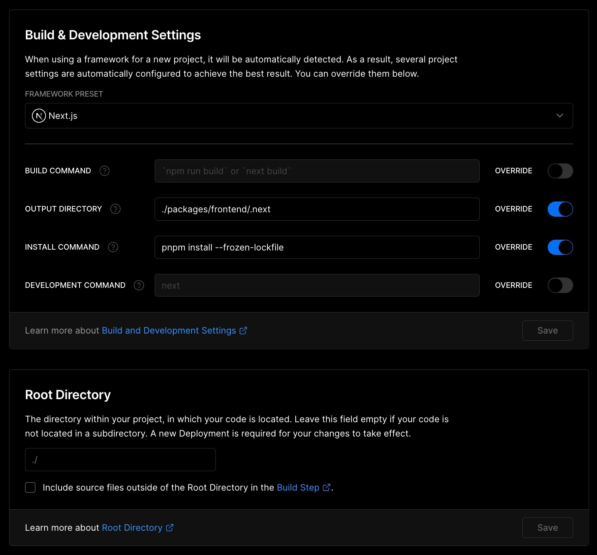

# Multi-network Faucet protected by Humanbound Tokens


## Getting Started

```bash
# Install pnpm
npm i -g pnpm

# Install dependencies
pnpm install

# Copy & fill environments
cp packages/frontend/.env.local.example packages/frontend/.env.local
cp packages/contracts/.env.example packages/contracts/.env
```


```bash
# Generate contract-types, start local hardhat node, and start frontend with turborepo
pnpm dev

# Only start frontend
pnpm frontend:dev
```

## Deployment

Setting up a deployment via Vercel is pretty straightforward, only a few things have to be configured differently (as it's a monorepo structure):

1. Press the **Deploy** button below:

[](https://vercel.com/new/clone?repository-url=https%3A%2F%2Fgithub.com%2Fethathon%2Fethathon&env=NEXT_PUBLIC_PRODUCTION_MODE,NEXT_PUBLIC_URL,NEXT_PUBLIC_DEFAULT_CHAIN,NEXT_PUBLIC_SUPPORTED_CHAINS,NEXT_PUBLIC_RPC_1&envDescription=See%20Environment%20Variables%20Examples%20%26%20Documentation&envLink=https%3A%2F%2Fgithub.com%2Fethathon%2Fethathon%2Fblob%2Fmain%2Fpackages%2Ffrontend%2F.env.local.example&redirect-url=https%3A%2F%2Fgithub.com%2Fethathon%2Fethathon)

2. Configure the environment variables (see [`packages/frontend/.env.local.example`](https://github.com/ethathon/ethathon/blob/main/packages/frontend/.env.local.example) for documentation)
3. Wait for the first build (which will fail) and update the build configuration as follows:

   - Set a custom output directory `./packages/frontend/.next`
   - Set a custom install command `pnpm install --frozen-lockfile`
   - Leave the root directory as `./`

4. Redeploy (Press the three dots next to the latest deployment in Vercel)


